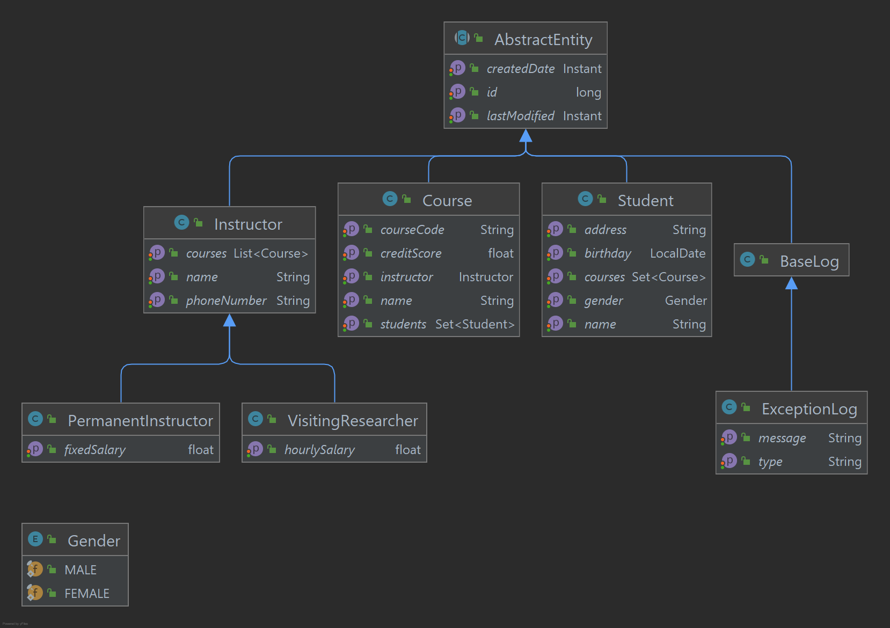

# Description
Fourth assignment of GittiGidiyor Java-Spring Bootcamp, a RESTFUL school management system with basic
CRUD operations, global error handling, validation.
# Technologies
- Spring Boot
- Spring DATA JPA
- Swagger
- MapStruct
- Java 16
# Usage
Can be simply run with [Spring Boot Maven plugin](https://docs.spring.io/spring-boot/docs/current/reference/html/build-tool-plugins-maven-plugin.html) like so:

```shell
$ git clone https://github.com/113-GittiGidiyor-Java-Spring-Bootcamp/fourth-homework-erhancavar
$ cd fourth-homework-erhancavar
$ mvn spring-boot:run
```

# Details
The main data model is as shown below:
[](model-diagram.png)
## Persistence
Four basic CRUD operations are available for all the concrete entity classes. They are nicely sampled at [Swagger UI endpoint](http://localhost:8080/swagger-ui.html) and can be tested on the same interface at will.
The custom response types can be inscpected under DTOr/responses package. Just a syntactic sugar.
## Exception Handling
Exceptions are mostly taken care of by a global exception handler class which is located in exceptions package.
Under the same package there are 8 custom exceptions, just for conveniences sake. All the exceptions are logged and
persisted to database with their creation date, type and message.
## Validaton
Fields are validated through DTO couples of base entity classes which are located under DTO package.
Validation errors are also handeled by the global exception handler class.

JAVADOCS are available for further understanding.

# Contributing
Pull requests are welcome. For major changes, please open an issue first to discuss what you would like to change.
